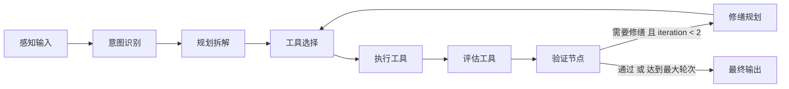

# 主 Agent 方案

## 1. AgentState

```ts
type MainAgentState = {
  sessionId: string;
  runId: string;
  persona: PersonaInput;
  messages: Array<{ role: "system" | "assistant" | "tool"; content: string }>;
  intent: IntentAnalysis | null;
  plan: AgentPlan | null;
  toolSelection: ToolSelection | null;
  proposal: GameProposal | null;
  story: StorySchema | null;
  characterCards: CharacterCard[] | null;
  evaluation: Evaluation | null;
  verification: VerificationResult | null;
  repairPlan: RepairPlan | null;
  iterationCount: number;
  maxIterations: number;
  finalResult: {
    游戏策划案: GameProposal | null;
    剧情角色包: CreativePack | null;
    评估结果: Evaluation | null;
  } | null;
};
```

## 2. 节点图



## 3. LangGraph 实现草图

```ts
const graph = new StateGraph<MainAgentState>({
  channels: {
    state: { value: initialState },
  },
});

graph
  .addNode("intent", intentNode)
  .addNode("plan", planNode)
  .addNode("select_tools", toolSelectionNode)
  .addNode("execute_tools", executeToolsNode)
  .addNode("evaluate", evaluateNode)
  .addNode("verify", verifyNode)
  .addNode("repair", repairNode)
  .addNode("finalize", finalizeNode);

graph.addEdge(START, "intent");
graph.addEdge("intent", "plan");
graph.addEdge("plan", "select_tools");
graph.addEdge("select_tools", "execute_tools");
graph.addEdge("execute_tools", "evaluate");
graph.addEdge("evaluate", "verify");

graph.addConditionalEdges("verify", (state) => {
  if (state.verification?.需要修缮 && state.iterationCount < state.maxIterations) {
    return "repair";
  }
  return "finalize";
});

graph.addEdge("repair", "select_tools");
graph.addEdge("finalize", END);
```

## 4. 工具层

- `proposal_tool`：生成游戏策划案
- `story_tool`：生成剧情方案
- `character_tool`：生成角色资料卡
- `evaluation_tool`：生成评估结果
- `verification_tool`：判断是否需要修缮
- `repair_tool`：为下一轮生成修缮计划

## 5. 当前实现说明

当前项目实现的是 LangGraph-compatible 的主 Agent 状态机：

- 单入口 `/api/run-agent`
- 统一 `AgentState`
- 节点化执行
- 最多两轮修缮
- 工具独立调用同一个模型 key
- 控制台按“感知输入 / 推理规划 / 工具调度 / 反馈优化”展示

后续如果需要正式切换到 LangGraph，主要替换的是节点注册与状态持久化方式，输入输出 schema 与工具层基本不需要重写。
